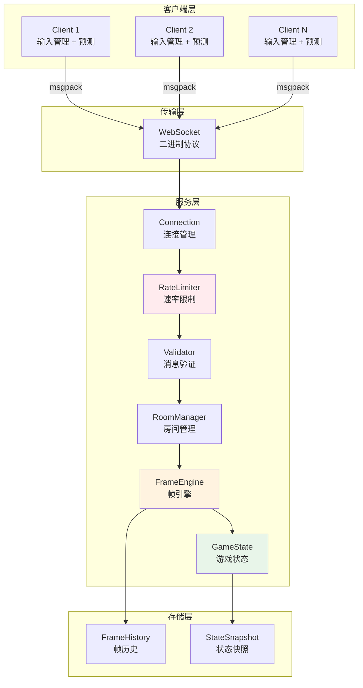
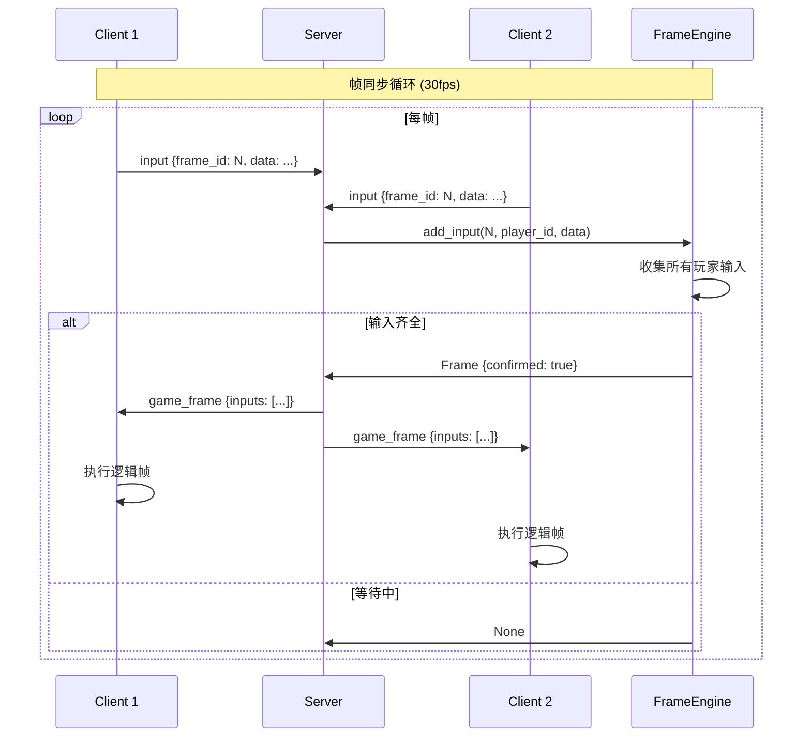
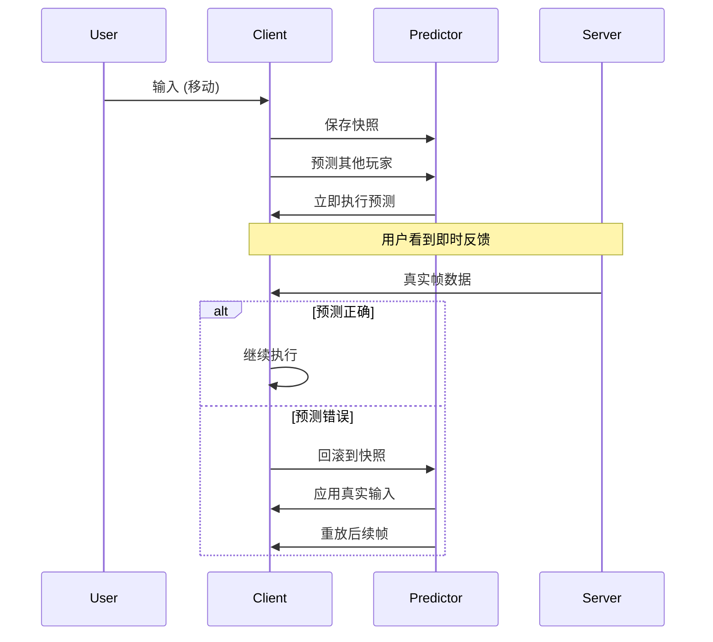

# Game Frame Sync - 游戏帧同步技术学习项目

> 从0到1学习游戏帧同步技术，Python 生产级实现

[](https://www.python.org/)
[](LICENSE)

## 📚 目录

- [项目简介](#-项目简介)
- [核心概念](#-核心概念)
- [系统架构](#-系统架构)
- [模块详解](#-模块详解)
- [数据流与协议](#-数据流与协议)
- [快速开始](#-快速开始)
- [配置说明](#-配置说明)
- [API 参考](#-api-参考)
- [性能优化](#-性能优化)
- [测试指南](#-测试指南)
- [部署指南](#-部署指南)
- [常见问题](#-常见问题)
- [文档目录](#-文档目录)

---

## 📖 项目简介

本项目旨在帮助开发者系统学习游戏帧同步技术，从基础概念到生产级实现，包含完整的服务端、客户端代码和详细文档。

### 适用场景

| 场景 | 适合度 | 说明 |
|------|--------|------|
| RTS 策略游戏 | ⭐⭐⭐⭐⭐ | 帧同步的经典应用场景 |
| 格斗游戏 | ⭐⭐⭐⭐⭐ | 低延迟、高精度同步 |
| 回合制游戏 | ⭐⭐⭐⭐ | 简化版即可满足 |
| MOBA | ⭐⭐⭐ | 需结合状态同步 |
| FPS 射击游戏 | ⭐⭐ | 建议使用状态同步 |
| MMO 大型多人 | ⭐ | 不推荐帧同步 |

### 核心特性

- ✅ **确定性物理模拟** - 定点数运算，跨平台一致
- ✅ **帧缓冲与延迟补偿** - 抵消网络延迟
- ✅ **客户端预测** - 零延迟输入响应
- ✅ **服务器权威校验** - 状态哈希验证
- ✅ **断线重连** - 帧历史追平
- ✅ **安全性防护** - 速率限制、输入验证
- ✅ **性能优化** - 空间网格碰撞检测

---

## 🎯 核心概念

### 什么是帧同步？

**帧同步（Lockstep）** 是一种多人游戏同步技术，核心思想是：

> **所有客户端在相同的逻辑帧上执行相同的输入，从而得到相同的游戏状态。**

### 帧同步 vs 状态同步

```
┌─────────────────────────────────────────────────────────────────┐
│                        同步方式对比                              │
├─────────────────────────────────────────────────────────────────┤
│                                                                 │
│  【帧同步】                    【状态同步】                       │
│                                                                 │
│  Client A ──输入──┐            Client A ──输入──┐               │
│                    │                               │              │
│  Client B ──输入──┼──▶ Server ──转发──▶ Clients  │              │
│                    │    (只转发输入)    (各自计算) │              │
│  Client C ──输入──┘                               │              │
│                                                    ▼              │
│  带宽: 低 (仅输入)           Server ──计算状态──▶ Clients       │
│  服务端: 轻量 (转发)                  (下发完整状态)              │
│  延迟: 敏感                  带宽: 高 (完整状态)                  │
│  作弊: 较难防范              服务端: 重量 (计算)                  │
│                              作弊: 容易防范                       │
│                                                                 │
└─────────────────────────────────────────────────────────────────┘
```

### 关键术语

| 术语 | 说明 |
|------|------|
| **逻辑帧** | 固定频率（如 30fps）的游戏逻辑更新 |
| **渲染帧** | 可变频率（如 60fps）的画面渲染 |
| **帧缓冲** | 预存几帧数据，抵消网络延迟 |
| **确定性** | 相同输入 + 相同初始状态 = 相同结果 |
| **定点数** | 整数表示小数，保证跨平台精度一致 |
| **客户端预测** | 不等待服务器，本地先执行输入 |
| **回滚** | 预测错误时，回退到正确状态重放 |

---

## 🏗️ 系统架构

### 整体架构图



### 核心组件说明

#### 1. 服务端组件

```
server/
├── main.py                 # 主入口
│   ├── GameServer          # 服务器主类
│   ├── RateLimiter         # 速率限制器
│   ├── MessageValidator    # 消息验证器
│   ├── Player              # 玩家数据类
│   └── GameRoom            # 房间数据类
```

**GameServer 职责：**
- WebSocket 连接管理
- 玩家认证与房间分配
- 消息路由与广播
- 帧循环驱动（30fps）

**安全组件：**
- `RateLimiter`: 100 req/sec 限制
- `MessageValidator`: 10KB 大小限制、类型白名单
- `InputValidator`: 帧ID范围、输入大小验证

#### 2. 核心模块

```
core/
├── __init__.py             # 模块导出
├── frame.py                # 帧数据管理
│   ├── Frame               # 帧数据结构
│   ├── FrameBuffer         # 帧缓冲管理
│   └── FrameEngine         # 帧同步引擎
├── input.py                # 输入处理
│   ├── PlayerInput         # 玩家输入
│   ├── InputManager        # 输入管理器
│   └── InputValidator      # 输入验证器
├── physics.py              # 物理引擎
│   ├── Entity              # 游戏实体
│   ├── PhysicsEngine       # 物理引擎
│   └── EntityPool          # 对象池
├── state.py                # 状态管理
│   ├── GameState           # 游戏状态
│   ├── StateSnapshot       # 状态快照
│   └── StateValidator      # 状态校验
└── rng.py                  # 随机数
    ├── DeterministicRNG    # 确定性RNG
    └── SeededRNG           # LCG随机数
```

---

## 📦 模块详解

### Frame 模块

帧是同步的基本单位，包含一帧内所有玩家的输入。

```python
from core.frame import Frame, FrameBuffer, FrameEngine

# 创建帧引擎
engine = FrameEngine(player_count=2, buffer_size=3)

# 添加玩家输入
engine.add_input(frame_id=0, player_id=1, input_data=b'input1')
engine.add_input(frame_id=0, player_id=2, input_data=b'input2')

# 执行帧
frame = engine.tick()
if frame:
    print(f"Frame {frame.frame_id}: confirmed={frame.confirmed}")
```

**帧生命周期：**

```
┌─────────┐     ┌─────────┐     ┌─────────┐     ┌─────────┐
│ 创建帧   │ ──▶ │ 收集输入 │ ──▶ │ 提交帧   │ ──▶ │ 执行帧   │
│         │     │         │     │         │     │         │
│ pending │     │ waiting │     │ ready   │     │ executed│
└─────────┘     └─────────┘     └─────────┘     └─────────┘
     │               │               │               │
     └───────────────┴───────────────┴───────────────┘
                     帧缓冲区 (buffer_size=3)
```

### Input 模块

输入采用紧凑的二进制格式，减少网络传输。

```python
from core.input import PlayerInput, InputFlags, InputManager

# 创建输入
input_data = PlayerInput(
    frame_id=1,
    player_id=1,
    flags=InputFlags.MOVE_RIGHT | InputFlags.ATTACK,
    target_x=500 << 16,  # 定点数
    target_y=300 << 16
)

# 序列化 (仅16字节)
serialized = input_data.serialize()  # 16 bytes

# 反序列化
restored = PlayerInput.deserialize(serialized)
```

**输入标志位：**

| 标志 | 值 | 说明 |
|------|-----|------|
| `MOVE_UP` | 0x01 | 向上移动 |
| `MOVE_DOWN` | 0x02 | 向下移动 |
| `MOVE_LEFT` | 0x04 | 向左移动 |
| `MOVE_RIGHT` | 0x08 | 向右移动 |
| `ATTACK` | 0x10 | 攻击 |
| `SKILL_1` | 0x20 | 技能1 |
| `SKILL_2` | 0x40 | 技能2 |
| `JUMP` | 0x80 | 跳跃 |

### Physics 模块

物理引擎使用**定点数**保证确定性。

```python
from core.physics import Entity, PhysicsEngine

# 创建物理引擎
engine = PhysicsEngine()

# 创建实体（定点数坐标）
entity = Entity.from_float(1, x=100.0, y=200.0)
entity.vx = 200 << 16  # 速度 200 像素/秒

engine.add_entity(entity)

# 更新物理（33ms = 1帧 @ 30fps）
engine.update(33)

# 获取位置
x, y = entity.to_float()  # (103.3, 200.0)
```

**定点数格式（16.16）：**

```
32位整数 = 16位整数部分 + 16位小数部分

示例：
  100.5 → 100 * 65536 + 32768 = 6586368
  转换: 6586368 / 65536 = 100.5
  
优点：
  ✅ 整数运算，跨平台一致
  ✅ 无浮点精度问题
  ✅ 可直接序列化
```

**空间网格优化：**

```
传统碰撞检测: O(n²)
  每个实体与其他所有实体检测

空间网格优化: O(n)
  ┌───┬───┬───┬───┐
  │ A │   │ B │   │
  ├───┼───┼───┼───┤
  │   │ C │   │ D │
  ├───┼───┼───┼───┤
  │ E │   │ F │   │
  └───┴───┴───┴───┘
  
  只检测同格子和相邻格子内的实体
```

### State 模块

状态管理支持快照和回滚。

```python
from core.state import GameState, StateSnapshot

state = GameState()

# 保存快照
snapshot = state.save_snapshot()
print(f"Hash: {snapshot.hash}")

# 修改状态
state.frame_id = 200

# 回滚
state.restore_snapshot(100)
print(f"Frame: {state.frame_id}")  # 100
```

### RNG 模块

确定性随机数生成器。

```python
from core.rng import DeterministicRNG

# 相同种子 → 相同序列
rng1 = DeterministicRNG(12345)
rng2 = DeterministicRNG(12345)

assert rng1.range(0, 100) == rng2.range(0, 100)  # True
assert rng1.uniform() == rng2.uniform()  # True
```

---

## 🔄 数据流与协议

### 网络协议

使用 **msgpack** 二进制序列化，比 JSON 更紧凑。

#### 消息格式

```python
# 客户端 → 服务器
{
    'type': 'input',
    'payload': {
        'frame_id': 100,
        'input_data': b'\x00\x01\x08...'  # 16 bytes
    }
}

# 服务器 → 客户端
{
    'type': 'game_frame',
    'payload': {
        'frame_id': 100,
        'inputs': {
            '1': b'input1',
            '2': b'input2'
        },
        'confirmed': True
    }
}
```

#### 消息类型

| 类型 | 方向 | 说明 |
|------|------|------|
| `auth` | C→S | 认证请求 |
| `join_success` | S→C | 加入成功 |
| `player_joined` | S→C | 玩家加入通知 |
| `player_left` | S→C | 玩家离开通知 |
| `game_start` | S→C | 游戏开始 |
| `input` | C→S | 玩家输入 |
| `game_frame` | S→C | 游戏帧数据 |
| `sync_frames` | S→C | 重连同步数据 |

### 帧同步流程



### 客户端预测流程



---

## 🚀 快速开始

### 安装

```bash
# 克隆项目
git clone https://github.com/kongshan001/game-frame-sync.git
cd game-frame-sync

# 创建虚拟环境
python3 -m venv venv
source venv/bin/activate  # Linux/Mac
# 或 venv\Scripts\activate  # Windows

# 安装依赖
pip install -r requirements.txt
```

### 启动服务器

```bash
# 默认端口 8765
python -m server.main

# 自定义配置
python -m server.main --host 0.0.0.0 --port 9000
```

### 启动客户端

```python
import asyncio
from client.game_client import GameClient
from core.input import InputFlags

async def main():
    client = GameClient()
    
    # 连接服务器
    await client.connect(
        server_url='ws://localhost:8765',
        player_id='player_1',
        room_id='room_001'
    )
    
    # 游戏循环
    while True:
        # 设置输入
        client.set_input(InputFlags.MOVE_RIGHT)
        
        # 发送输入
        await client.send_input()
        
        # 等待下一帧
        await asyncio.sleep(1/30)

asyncio.run(main())
```

### 运行测试

```bash
# 运行所有测试
pytest tests/ -v

# 带覆盖率报告
pytest tests/ -v --cov=core --cov-report=html

# 运行特定测试
pytest tests/test_core.py::TestPhysicsEngine -v
```

---

## ⚙️ 配置说明

### 服务器配置

```python
config = {
    # 网络配置
    'host': '0.0.0.0',
    'port': 8765,
    
    # 游戏配置
    'max_players': 4,           # 每房间最大玩家数
    'frame_timeout': 1.0,       # 帧超时（秒）
    
    # 安全配置
    'max_requests_per_second': 100,  # 速率限制
    'max_input_size': 1024,          # 输入大小限制
}

server = GameServer(config)
await server.start()
```

### 帧引擎配置

```python
from core.frame import FrameEngine

engine = FrameEngine(
    player_count=4,      # 玩家数量
    buffer_size=3        # 帧缓冲大小（帧数）
)

# 帧缓冲建议值：
# - 本地/LAN: 1-2 帧
# - 互联网: 2-4 帧
# - 移动网络: 4-6 帧
```

### 物理引擎配置

```python
from core.physics import PhysicsEngine

engine = PhysicsEngine()

# 自定义世界边界
engine.WORLD_WIDTH = 1920 << 16
engine.WORLD_HEIGHT = 1080 << 16

# 自定义物理参数
engine.GRAVITY = 980 << 16      # 重力
engine.FRICTION = 58982         # 摩擦力 (0.9 定点数)
engine.MAX_VELOCITY = 1000 << 16  # 最大速度
```

---

## 📖 API 参考

### GameServer

```python
class GameServer:
    """帧同步游戏服务器"""
    
    def __init__(self, config: dict = None):
        """初始化服务器"""
    
    async def start(self, host: str = '0.0.0.0', port: int = 8765):
        """启动服务器"""
    
    async def _broadcast_to_room(self, room_id: str, message, 
                                  binary=False, exclude_player=None):
        """向房间广播消息"""
    
    def get_stats(self) -> dict:
        """获取服务器统计"""
```

### FrameEngine

```python
class FrameEngine:
    """帧同步引擎"""
    
    def __init__(self, player_count: int = 2, buffer_size: int = 3):
        """初始化"""
    
    def add_input(self, frame_id: int, player_id: int, input_data: bytes):
        """添加玩家输入"""
    
    def tick(self) -> Optional[Frame]:
        """执行一帧，返回完成的帧或None"""
    
    def force_tick(self) -> Frame:
        """强制执行帧（填充空输入）"""
    
    def get_frame(self, frame_id: int) -> Optional[Frame]:
        """获取历史帧"""
    
    def get_stats(self) -> dict:
        """获取引擎统计"""
```

### PhysicsEngine

```python
class PhysicsEngine:
    """确定性物理引擎"""
    
    def add_entity(self, entity: Entity):
        """添加实体"""
    
    def remove_entity(self, entity_id: int):
        """移除实体"""
    
    def update(self, dt_ms: int):
        """更新物理（dt_ms: 毫秒）"""
    
    def apply_input(self, entity_id: int, input_flags: int, speed: int):
        """应用输入到实体"""
    
    def serialize_state(self) -> dict:
        """序列化状态"""
```

### Entity

```python
class Entity:
    """游戏实体（定点数坐标）"""
    
    FIXED_SHIFT = 16  # 定点数精度
    
    @classmethod
    def from_float(cls, entity_id: int, x: float, y: float) -> 'Entity':
        """从浮点数创建"""
    
    def to_float(self) -> Tuple[float, float]:
        """转浮点数"""
    
    def update_position(self, dt_ms: int):
        """更新位置"""
    
    def reset(self):
        """重置状态（对象池用）"""
```

---

## ⚡ 性能优化

### 已实现优化

| 优化项 | 方法 | 效果 |
|--------|------|------|
| 空间网格碰撞 | 划分64px网格 | O(n²) → O(n) |
| 对象池 | EntityPool 复用 | 减少 GC |
| 定点数 | 16.16格式 | 避免浮点误差 |
| 二进制协议 | msgpack | 比JSON小50% |
| 输入压缩 | 16字节固定格式 | 最小化带宽 |

### 性能基准

```python
# 测试环境: i7-12700, 32GB RAM
# 100实体 × 100帧

物理更新: 128ms (1.28ms/帧)
帧引擎: 50ms (0.5ms/帧)
内存占用: 2MB/房间
网络带宽: 5KB/s/玩家
```

### 优化建议

1. **服务端多进程** - 每个 CPU 核心运行独立进程
2. **房间分片** - 按房间ID哈希分配到不同进程
3. **Redis Pub/Sub** - 跨进程房间通信
4. **帧压缩** - zlib 压缩历史帧存储

---

## 🧪 测试指南

### 测试结构

```
tests/
├── test_core.py            # 核心模块测试
│   ├── TestFrame           # 帧测试
│   ├── TestFrameBuffer     # 帧缓冲测试
│   ├── TestFrameEngine     # 帧引擎测试
│   ├── TestPlayerInput     # 输入测试
│   ├── TestEntity          # 实体测试
│   ├── TestPhysicsEngine   # 物理测试
│   ├── TestDeterministicRNG# RNG测试
│   └── TestGameState       # 状态测试
├── test_server.py          # 服务器测试 (TODO)
├── test_client.py          # 客户端测试 (TODO)
└── test_integration.py     # 集成测试 (TODO)
```

### 运行测试

```bash
# 全部测试
pytest tests/ -v

# 覆盖率报告
pytest tests/ --cov=core --cov=server --cov-report=html

# 只运行物理测试
pytest tests/test_core.py::TestPhysicsEngine -v

# 并行测试
pytest tests/ -n 4
```

### 编写测试

```python
import pytest
from core.physics import PhysicsEngine, Entity

class TestMyFeature:
    def test_determinism(self):
        """测试确定性"""
        engine1 = PhysicsEngine()
        engine2 = PhysicsEngine()
        
        # 相同初始条件
        e1 = Entity(entity_id=1, x=0, y=0)
        e2 = Entity(entity_id=1, x=0, y=0)
        
        engine1.add_entity(e1)
        engine2.add_entity(e2)
        
        # 执行相同操作
        for _ in range(100):
            engine1.update(33)
            engine2.update(33)
        
        # 验证结果一致
        assert e1.x == e2.x
```

---

## 🐳 部署指南

### Docker 部署

```dockerfile
# Dockerfile
FROM python:3.10-slim

WORKDIR /app

COPY requirements.txt .
RUN pip install --no-cache-dir -r requirements.txt

COPY . .

EXPOSE 8765

CMD ["python", "-m", "server.main"]
```

```yaml
# docker-compose.yml
version: '3.8'

services:
  game-server:
    build: .
    ports:
      - "8765:8765"
    environment:
      - REDIS_URL=redis://redis:6379
    deploy:
      replicas: 3
      resources:
        limits:
          cpus: '2'
          memory: 2G
  
  redis:
    image: redis:7-alpine
    volumes:
      - redis-data:/data

volumes:
  redis-data:
```

```bash
# 启动
docker-compose up -d

# 扩容
docker-compose up -d --scale game-server=5
```

### 生产环境配置

```python
# config/production.py
config = {
    'host': '0.0.0.0',
    'port': 8765,
    'max_players': 4,
    'frame_timeout': 1.0,
    'max_requests_per_second': 100,
    
    # Redis
    'redis_url': 'redis://localhost:6379',
    
    # 日志
    'log_level': 'INFO',
    
    # 监控
    'metrics_enabled': True,
    'metrics_port': 9090,
}
```

### 负载均衡

```
                    ┌─────────────┐
                    │   Nginx     │
                    │  (SSL/WS)   │
                    └─────────────┘
                          │
        ┌─────────────────┼─────────────────┐
        ▼                 ▼                 ▼
┌───────────────┐ ┌───────────────┐ ┌───────────────┐
│ Game Server 1 │ │ Game Server 2 │ │ Game Server N │
│   (8765)      │ │   (8765)      │ │   (8765)      │
└───────────────┘ └───────────────┘ └───────────────┘
        │                 │                 │
        └─────────────────┼─────────────────┘
                          ▼
                    ┌─────────────┐
                    │    Redis    │
                    │  (Pub/Sub)  │
                    └─────────────┘
```

---

## ❓ 常见问题

### Q1: 状态不同步怎么办？

**诊断步骤：**
1. 检查是否使用了浮点数（应使用定点数）
2. 检查随机数是否同步了种子
3. 检查遍历顺序是否固定
4. 使用状态哈希定期校验

**解决方案：**
```python
# 定期校验
if frame_id % 60 == 0:
    hash = game_state.compute_state_hash()
    # 与服务器或其他客户端对比
```

### Q2: 如何处理网络延迟？

1. **帧缓冲** - 增加 buffer_size（2-4帧）
2. **客户端预测** - 本地立即执行
3. **插值渲染** - 平滑画面显示

### Q3: 如何防止作弊？

```python
# 服务端验证
- 输入范围检查
- 速率限制
- 状态哈希校验
- 多数投票机制
```

### Q4: 支持多少玩家？

| 配置 | 理论上限 | 推荐值 |
|------|----------|--------|
| 帧同步 | 8-16人 | 4-8人 |
| 状态同步 | 64+人 | 32人 |

### Q5: 如何实现断线重连？

1. 服务端保留最近 N 帧历史
2. 客户端重连时发送 last_frame
3. 服务端发送缺失的帧数据
4. 客户端快速追帧（不渲染）

---

## 📚 文档目录

| 章节 | 内容 | 难度 |
|------|------|------|
| [01-基础概念](docs/01-basics.md) | 帧同步 vs 状态同步，核心原理 | ⭐ |
| [02-确定性模拟](docs/02-determinism.md) | 浮点数问题，随机数同步 | ⭐⭐ |
| [03-网络架构](docs/03-network.md) | 协议设计，帧缓冲 | ⭐⭐ |
| [04-延迟优化](docs/04-optimization.md) | 客户端预测，延迟补偿 | ⭐⭐⭐ |
| [05-技术卡点](docs/05-challenges.md) | 常见问题与解决方案 | ⭐⭐⭐ |
| [06-生产实践](docs/06-production.md) | 性能优化，容错处理 | ⭐⭐⭐⭐ |

---

## 🤝 贡献指南

欢迎提交 Issue 和 Pull Request！

1. Fork 本仓库
2. 创建特性分支 (`git checkout -b feature/AmazingFeature`)
3. 提交更改 (`git commit -m 'Add some AmazingFeature'`)
4. 推送到分支 (`git push origin feature/AmazingFeature`)
5. 创建 Pull Request

---

## 📄 License

MIT License - 详见 [LICENSE](LICENSE) 文件

---

## 🙏 致谢

感谢以下资源和项目启发：

- [Gaffer On Games](https://gafferongames.com/) - 网络游戏开发经典教程
- [《网络游戏核心技术》](https://book.douban.com/subject/4117360/) - 经典书籍
- [Quake 3 Source Code](https://github.com/id-Software/Quake-III-Arena) - 经典实现参考
