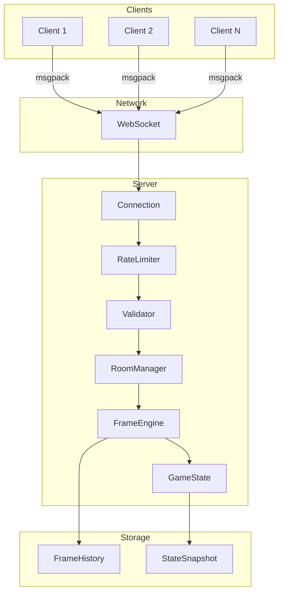
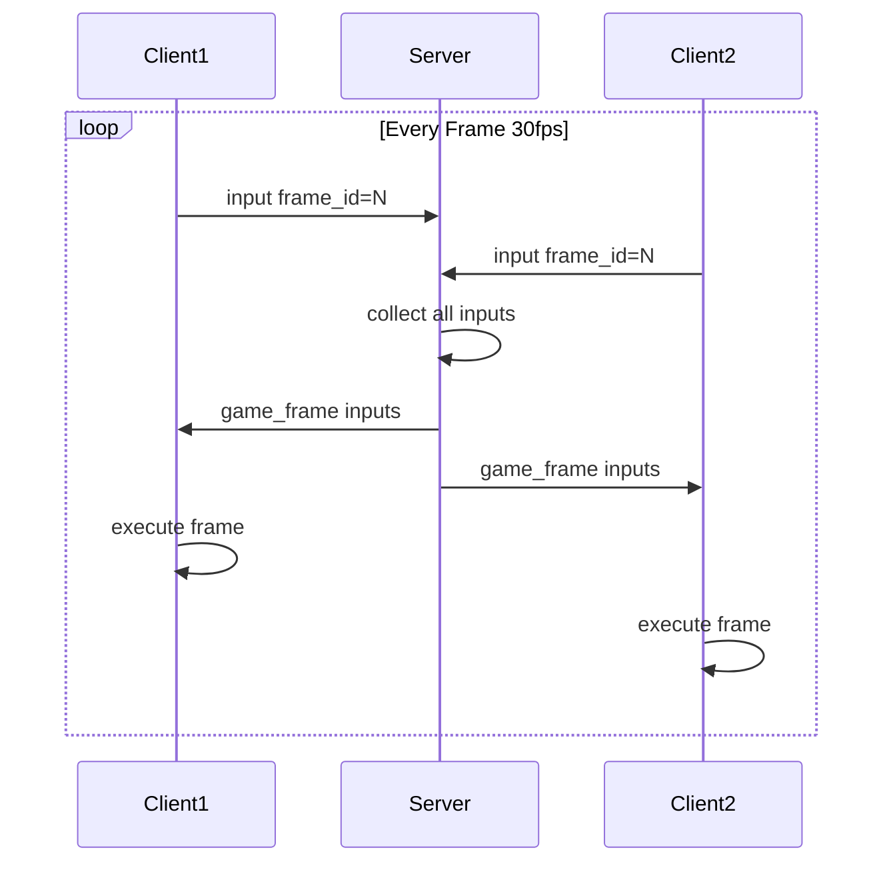
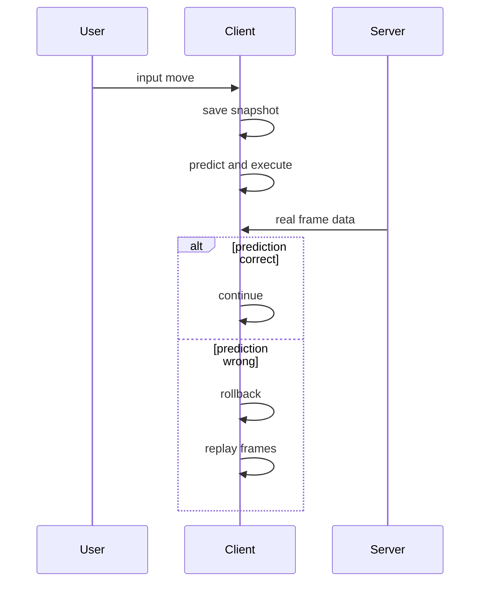

# Game Frame Sync - 游戏帧同步技术学习项目

> 从0到1学习游戏帧同步技术，Python 生产级实现

[](https://www.python.org/)
[](LICENSE)

## 项目简介

本项目旨在帮助开发者系统学习游戏帧同步技术，从基础概念到生产级实现，包含完整的服务端、客户端代码和详细文档。

### 适用场景

| 场景 | 适合度 | 说明 |
|------|--------|------|
| RTS 策略游戏 | ★★★★★ | 帧同步的经典应用场景 |
| 格斗游戏 | ★★★★★ | 低延迟、高精度同步 |
| 回合制游戏 | ★★★★ | 简化版即可满足 |
| MOBA | ★★★ | 需结合状态同步 |
| FPS 射击游戏 | ★★ | 建议使用状态同步 |
| MMO 大型多人 | ★ | 不推荐帧同步 |

### 核心特性

- ✅ **确定性物理模拟** - 定点数运算，跨平台一致
- ✅ **帧缓冲与延迟补偿** - 抵消网络延迟
- ✅ **客户端预测** - 零延迟输入响应
- ✅ **服务器权威校验** - 状态哈希验证
- ✅ **断线重连** - 帧历史追平
- ✅ **安全性防护** - 速率限制、输入验证
- ✅ **性能优化** - 空间网格碰撞检测

---

## 系统架构

### 整体架构图



### 帧同步流程



### 客户端预测流程



---

## 项目结构

```
game-frame-sync/
├── server/                 # 帧同步服务端
│   └── main.py             # 服务入口
├── client/                 # 客户端示例
│   └── game_client.py      # 网络客户端
├── core/                   # 核心同步逻辑
│   ├── frame.py            # 帧数据结构
│   ├── input.py            # 输入处理
│   ├── physics.py          # 确定性物理
│   ├── state.py            # 游戏状态
│   └── rng.py              # 确定性随机数
├── docs/                   # 文档
├── tests/                  # 单元测试
├── requirements.txt        # 依赖
└── README.md
```

---

## 核心模块

### Frame 模块

帧是同步的基本单位，包含一帧内所有玩家的输入。

```python
from core.frame import Frame, FrameBuffer, FrameEngine

# 创建帧引擎
engine = FrameEngine(player_count=2, buffer_size=3)

# 添加玩家输入
engine.add_input(frame_id=0, player_id=1, input_data=b'input1')
engine.add_input(frame_id=0, player_id=2, input_data=b'input2')

# 执行帧
frame = engine.tick()
if frame:
    print(f"Frame {frame.frame_id}: confirmed={frame.confirmed}")
```

### Input 模块

输入采用紧凑的二进制格式（16字节），减少网络传输。

```python
from core.input import PlayerInput, InputFlags

# 创建输入
input_data = PlayerInput(
    frame_id=1,
    player_id=1,
    flags=InputFlags.MOVE_RIGHT | InputFlags.ATTACK
)

# 序列化
serialized = input_data.serialize()  # 16 bytes
```

### Physics 模块

物理引擎使用**定点数**（16.16格式）保证确定性。

```python
from core.physics import Entity, PhysicsEngine

# 创建物理引擎
engine = PhysicsEngine()

# 创建实体（定点数坐标）
entity = Entity.from_float(1, x=100.0, y=200.0)
entity.vx = 200 << 16  # 速度 200 像素/秒

engine.add_entity(entity)
engine.update(33)  # 33ms = 1帧 @ 30fps

# 获取位置
x, y = entity.to_float()
```

### State 模块

状态管理支持快照和回滚。

```python
from core.state import GameState

state = GameState()
state.frame_id = 100

# 保存快照
snapshot = state.save_snapshot()

# 修改状态
state.frame_id = 200

# 回滚
state.restore_snapshot(100)
print(state.frame_id)  # 100
```

### RNG 模块

确定性随机数生成器，相同种子产生相同序列。

```python
from core.rng import DeterministicRNG

rng1 = DeterministicRNG(12345)
rng2 = DeterministicRNG(12345)

assert rng1.range(0, 100) == rng2.range(0, 100)  # True
```

---

## 快速开始

### 安装

```bash
# 克隆项目
git clone https://github.com/kongshan001/game-frame-sync.git
cd game-frame-sync

# 创建虚拟环境
python3 -m venv venv
source venv/bin/activate

# 安装依赖
pip install -r requirements.txt
```

### 启动服务器

```bash
python -m server.main
```

### 启动客户端

```python
import asyncio
from client.game_client import GameClient
from core.input import InputFlags

async def main():
    client = GameClient()
    await client.connect(
        server_url='ws://localhost:8765',
        player_id='player_1',
        room_id='room_001'
    )
    
    while True:
        client.set_input(InputFlags.MOVE_RIGHT)
        await client.send_input()
        await asyncio.sleep(1/30)

asyncio.run(main())
```

### 运行测试

```bash
pytest tests/ -v
```

---

## 网络协议

使用 **msgpack** 二进制序列化。

### 消息类型

| 类型 | 方向 | 说明 |
|------|------|------|
| `auth` | C->S | 认证请求 |
| `join_success` | S->C | 加入成功 |
| `input` | C->S | 玩家输入 |
| `game_frame` | S->C | 游戏帧数据 |
| `player_joined` | S->C | 玩家加入 |
| `player_left` | S->C | 玩家离开 |
| `sync_frames` | S->C | 重连同步 |

---

## 性能优化

| 优化项 | 方法 | 效果 |
|--------|------|------|
| 空间网格碰撞 | 64px网格分区 | O(n²) -> O(n) |
| 对象池 | EntityPool复用 | 减少GC |
| 定点数 | 16.16格式 | 避免浮点误差 |
| 二进制协议 | msgpack | 比JSON小50% |
| 输入压缩 | 16字节固定格式 | 最小化带宽 |

---

## 部署

### Docker

```bash
# 构建镜像
docker build -t game-frame-sync .

# 运行
docker run -p 8765:8765 game-frame-sync
```

### Docker Compose

```bash
docker-compose up -d
```

---

## 文档

| 章节 | 内容 |
|------|------|
| [01-基础概念](docs/01-basics.md) | 帧同步 vs 状态同步 |
| [02-确定性模拟](docs/02-determinism.md) | 浮点数、随机数 |
| [03-网络架构](docs/03-network.md) | 协议设计、帧缓冲 |
| [04-延迟优化](docs/04-optimization.md) | 客户端预测 |
| [05-技术卡点](docs/05-challenges.md) | 常见问题与解决方案 |
| [06-生产实践](docs/06-production.md) | 性能优化、部署 |

---

## 常见问题

### Q1: 状态不同步怎么办？

1. 检查是否使用了浮点数（应使用定点数）
2. 检查随机数是否同步了种子
3. 检查遍历顺序是否固定
4. 使用状态哈希定期校验

### Q2: 如何处理网络延迟？

1. **帧缓冲** - 增加 buffer_size（2-4帧）
2. **客户端预测** - 本地立即执行
3. **插值渲染** - 平滑画面显示

### Q3: 如何防止作弊？

- 输入范围检查
- 速率限制
- 状态哈希校验
- 多数投票机制

---

## License

MIT License
