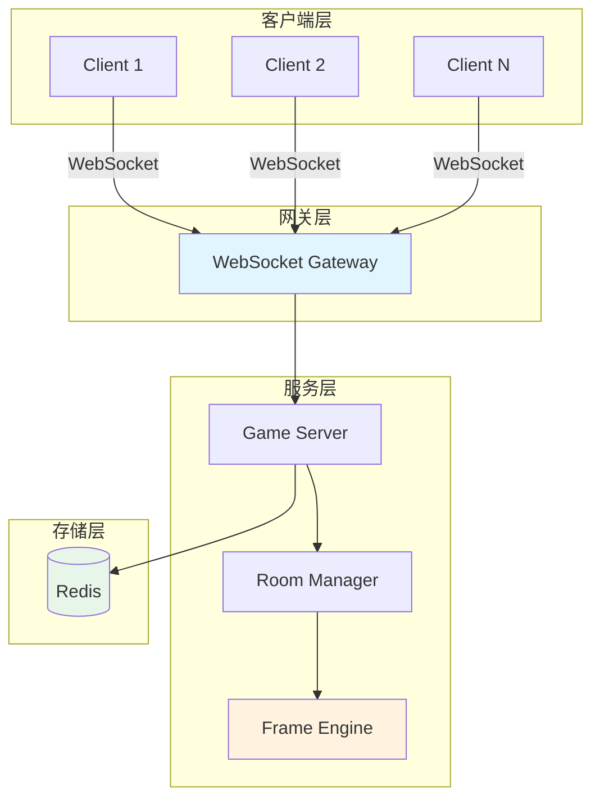
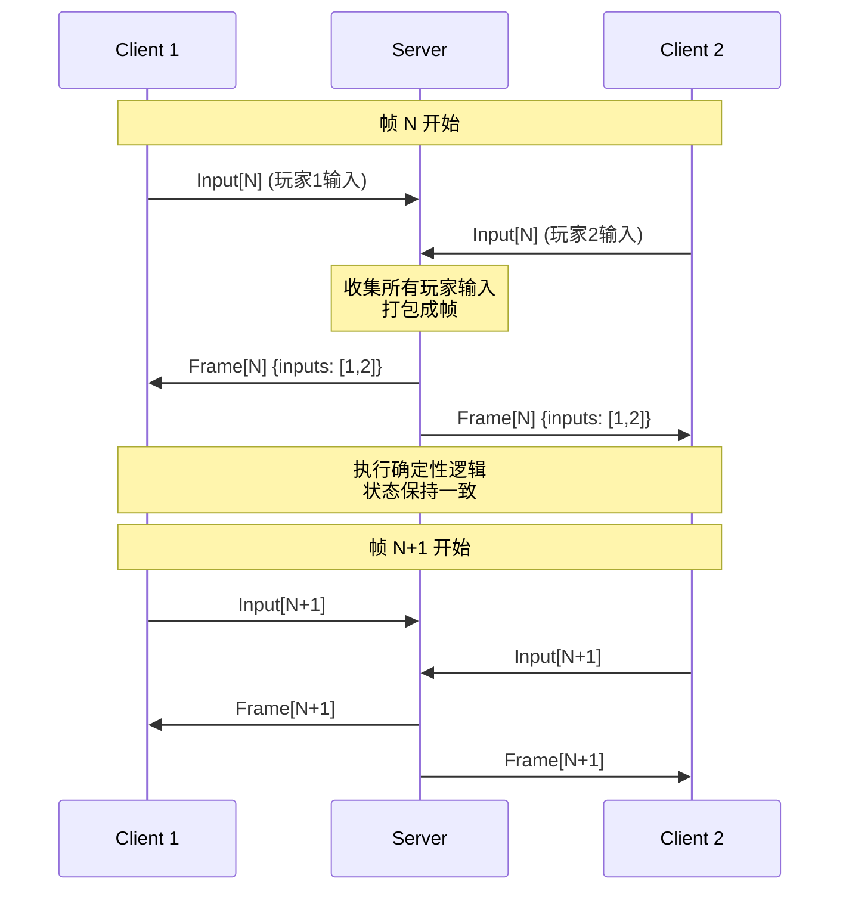
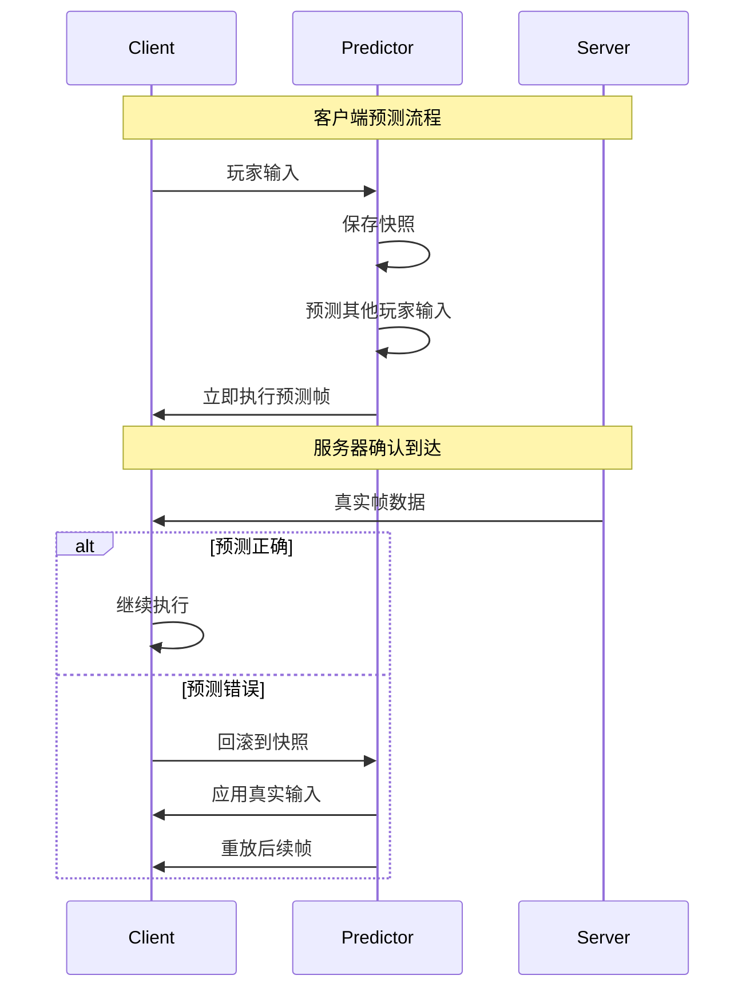
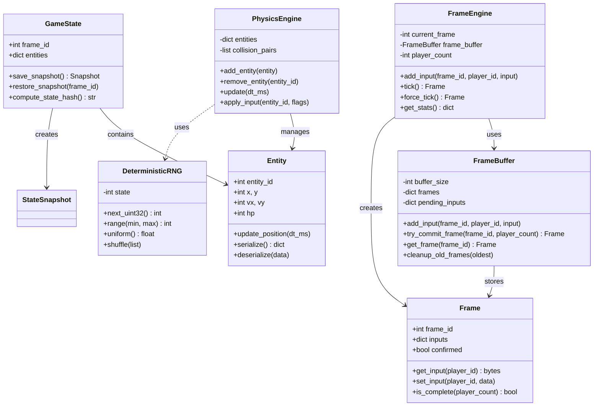
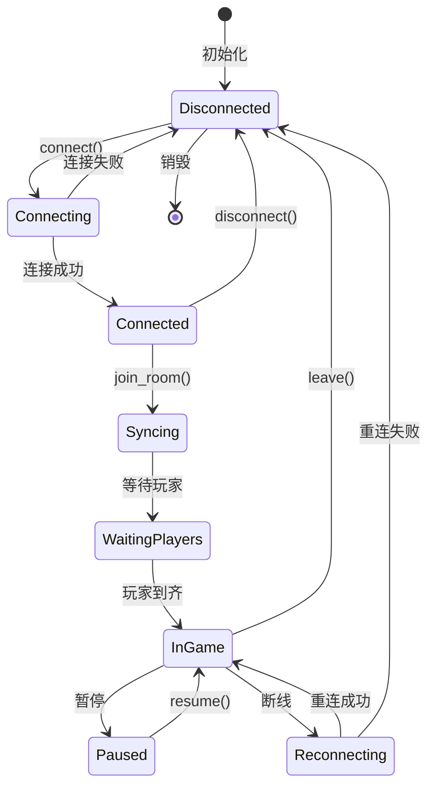
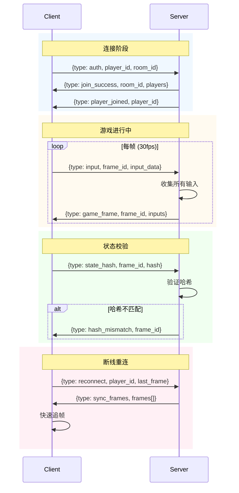
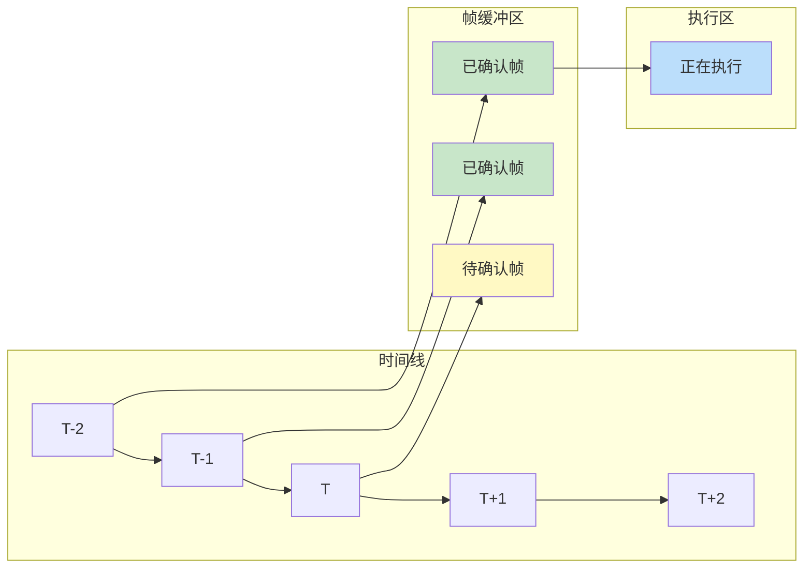
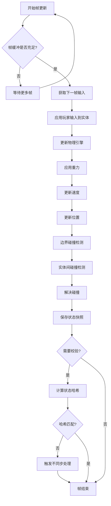

# Game Frame Sync - 游戏帧同步技术学习项目

> 从0到1学习游戏帧同步技术，Python 生产级实现

## 📚 项目简介

本项目旨在帮助开发者系统学习游戏帧同步技术，从基础概念到生产级实现，包含完整的服务端、客户端代码和详细文档。

## 📖 文档目录

| 章节 | 内容 | 难度 |
|------|------|------|
| [01-基础概念](docs/01-basics.md) | 帧同步 vs 状态同步，核心原理 | ⭐ |
| [02-确定性模拟](docs/02-determinism.md) | 浮点数问题，随机数同步 | ⭐⭐ |
| [03-网络架构](docs/03-network.md) | 协议设计，帧缓冲 | ⭐⭐ |
| [04-延迟优化](docs/04-optimization.md) | 客户端预测，延迟补偿 | ⭐⭐⭐ |
| [05-技术卡点](docs/05-challenges.md) | 常见问题与解决方案 | ⭐⭐⭐ |
| [06-生产实践](docs/06-production.md) | 性能优化，容错处理 | ⭐⭐⭐⭐ |

## 🏗️ 项目结构

```
game-frame-sync/
├── server/                 # 帧同步服务端
│   └── main.py             # 服务入口
├── client/                 # 客户端示例
│   └── game_client.py      # 网络客户端
├── core/                   # 核心同步逻辑
│   ├── frame.py            # 帧数据结构
│   ├── input.py            # 输入处理
│   ├── physics.py          # 确定性物理
│   ├── state.py            # 游戏状态
│   └── rng.py              # 确定性随机数
├── docs/                   # 文档
├── tests/                  # 单元测试
├── config/                 # 配置文件
└── scripts/                # 辅助脚本
```

## 🚀 快速开始

```bash
# 克隆项目
git clone https://github.com/kongshan001/game-frame-sync.git
cd game-frame-sync

# 安装依赖
pip install -r requirements.txt

# 启动服务端
python -m server.main

# 启动客户端（另一个终端）
python -m client.game_client
```

## 🔧 技术栈

- **Python 3.10+**
- **asyncio** - 异步网络 IO
- **websockets** - WebSocket 通信
- **msgpack** - 高效二进制序列化
- **pytest** - 单元测试

## 📋 核心特性

- ✅ 确定性物理模拟
- ✅ 帧缓冲与延迟补偿
- ✅ 客户端预测
- ✅ 服务器权威校验
- ✅ 断线重连
- ✅ 回放系统
- ✅ 性能监控

---

## 📐 UML 架构图

### 1. 系统架构图



### 2. 帧同步时序图



### 3. 客户端预测与回滚



### 4. 核心类图



### 5. 游戏状态机



### 6. 网络协议消息流



### 7. 帧缓冲工作原理



### 8. 确定性物理更新循环



---

## 🔍 技术卡点速查

| 问题 | 原因 | 解决方案 |
|------|------|----------|
| 状态不同步 | 浮点数精度差异 | 使用定点数 |
| 随机结果不同 | 随机序列不一致 | 同步种子 + 确定性RNG |
| 画面卡顿 | 网络延迟波动 | 帧缓冲 + 客户端预测 |
| 预测误差大 | 其他玩家行为难预测 | 智能预测算法 |
| 断线无法恢复 | 状态丢失 | 帧历史 + 状态同步 |
| 作弊检测难 | 客户端权威 | 哈希校验 + 多数投票 |

---

## 🤝 贡献

欢迎提交 Issue 和 PR！

## 📄 License

MIT License
