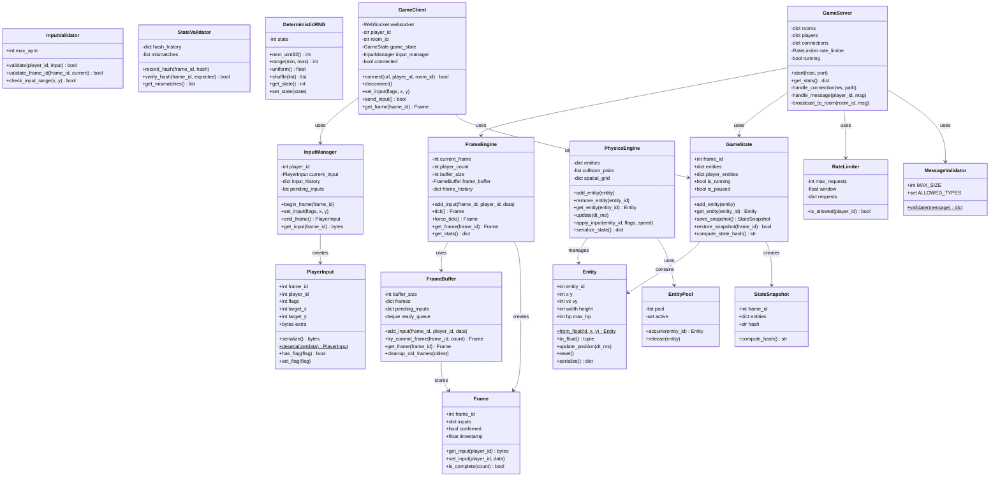

# Game Frame Sync - 游戏帧同步技术学习项目

> 从0到1学习游戏帧同步技术，Python 生产级实现

[](https://www.python.org/)
[](LICENSE)

## 目录

- [项目简介](#项目简介)
- [核心概念：定点数](#核心概念定点数)
- [系统架构](#系统架构)
- [核心类关系图](#核心类关系图)
- [类职责与API文档](#类职责与api文档)
  - [Frame 模块](#frame-模块)
  - [Input 模块](#input-模块)
  - [Physics 模块](#physics-模块)
  - [State 模块](#state-模块)
  - [RNG 模块](#rng-模块)
  - [Server 模块](#server-模块)
  - [Client 模块](#client-模块)
- [快速开始](#快速开始)
- [测试](#测试)
- [部署](#部署)
- [文档](#文档)

---

## 项目简介

本项目旨在帮助开发者系统学习游戏帧同步技术，从基础概念到生产级实现。

### 核心特性

- ✅ 确定性物理模拟（定点数运算）
- ✅ 帧缓冲与延迟补偿
- ✅ 客户端预测
- ✅ 服务器权威校验
- ✅ 断线重连
- ✅ 安全性防护（速率限制、输入验证）
- ✅ 性能优化（空间网格碰撞检测）

---

## 核心概念：定点数

### 为什么需要定点数？

帧同步的核心要求是**确定性**：所有客户端在相同输入下必须产生完全相同的结果。

然而，**浮点数（float）在不同平台上可能产生不同结果**：

```python
# 问题：浮点数的不确定性
a = 0.1 + 0.2  # 可能是 0.30000000000000004
b = 0.3        # 可能是 0.29999999999999999

# 不同 CPU 架构可能有细微差异
# x86 vs ARM 可能有不同的舍入行为
# 这会导致帧同步状态分叉！
```

**解决方案：使用定点数（Fixed-Point Number）**

### 什么是定点数？

定点数是用**整数**来表示小数的方法。通过将所有数值放大固定倍数，用整数运算替代浮点运算。

```
浮点数: 100.5
定点数: 100.5 * 65536 = 6586368 (整数)
```

### 定点数格式：16.16

本项目采用 **16.16 定点数格式**：

```
32位整数 = 16位整数部分 + 16位小数部分

┌────────────────┬────────────────┐
│   整数部分      │   小数部分      │
│   16 bits      │   16 bits      │
└────────────────┴────────────────┘
     高16位           低16位

范围: -32768.9999... ~ 32767.9999...
精度: 1/65536 ≈ 0.000015
```

### 定点数运算

#### 基本转换

```python
class FixedPoint:
    SCALE = 65536  # 2^16
    
    # 浮点数 → 定点数
    @staticmethod
    def from_float(value: float) -> int:
        return int(value * 65536)
    
    # 定点数 → 浮点数
    @staticmethod
    def to_float(value: int) -> float:
        return value / 65536
    
    # 定点数 → 整数（截断小数）
    @staticmethod
    def to_int(value: int) -> int:
        return value >> 16  # 等于 value // 65536
```

#### 加减法

定点数加减法与整数相同：

```python
# 加法
result = a + b

# 减法
result = a - b

# 示例
# 100.5 + 50.25 = ?
# 定点数: 6586368 + 3287040 = 9873408
# 转换回浮点: 9873408 / 65536 = 150.75 ✓
```

#### 乘法

乘法需要右移 16 位（因为两个 SCALE 相乘）：

```python
# 乘法
def mul(a: int, b: int) -> int:
    return (a * b) >> 16

# 示例
# 2.0 * 3.0 = ?
# 定点数: (131072 * 196608) >> 16 = 25769803776 >> 16 = 393216
# 转换回浮点: 393216 / 65536 = 6.0 ✓
```

#### 除法

除法需要先左移 16 位：

```python
# 除法
def div(a: int, b: int) -> int:
    return (a << 16) // b

# 示例
# 6.0 / 2.0 = ?
# 定点数: (393216 << 16) // 131072 = 25769803776 // 131072 = 196608
# 转换回浮点: 196608 / 65536 = 3.0 ✓
```

### 项目中的应用

#### Entity 类的定点数实现

```python
@dataclass
class Entity:
    entity_id: int
    x: int = 0      # 定点数坐标
    y: int = 0
    vx: int = 0     # 定点数速度
    vy: int = 0
    
    FIXED_SHIFT = 16
    FIXED_SCALE = 65536
    
    @classmethod
    def from_float(cls, entity_id: int, x: float, y: float) -> 'Entity':
        """从浮点数创建"""
        return cls(
            entity_id=entity_id,
            x=int(x * cls.FIXED_SCALE),
            y=int(y * cls.FIXED_SCALE)
        )
    
    def to_float(self) -> Tuple[float, float]:
        """转换为浮点数"""
        return (self.x / self.FIXED_SCALE, self.y / self.FIXED_SCALE)
    
    def update_position(self, dt_ms: int):
        """更新位置（整数运算）"""
        # v * dt / 1000
        self.x += (self.vx * dt_ms) // 1000
        self.y += (self.vy * dt_ms) // 1000
```

#### 物理引擎的定点数常量

```python
class PhysicsEngine:
    # 物理常量（定点数）
    GRAVITY = 980 << 16      # 980 像素/秒²
    FRICTION = 58982         # 0.9 的定点数 (0.9 * 65536 ≈ 58982)
    MAX_VELOCITY = 1000 << 16
    
    def update(self, dt_ms: int):
        for entity in self.entities.values():
            # 应用重力（定点数运算）
            entity.vy += (self.GRAVITY * dt_ms) // 1000
            
            # 应用摩擦力（定点数乘法）
            entity.vx = (entity.vx * self.FRICTION) >> 16
```

### 定点数 vs 浮点数对比

| 特性 | 浮点数 | 定点数 |
|------|--------|--------|
| 精度 | 可变（科学计数法） | 固定（小数点后4-5位） |
| 范围 | 很大（±10^308） | 有限（±32768） |
| 跨平台一致性 | ❌ 不保证 | ✅ 完全一致 |
| 运算速度 | 较慢（FPU） | 较快（整数） |
| 适用场景 | 通用计算 | 帧同步、嵌入式 |

### 定点数精度示例

```python
# 精度测试
x = 100.123456789

# 16.16 定点数
fixed_x = int(x * 65536)           # 6568085
restored = fixed_x / 65536          # 100.12345886230469

# 精度损失：约 0.000001
# 对于游戏物理模拟足够精确
```

### 常用定点数工具函数

```python
# 平方根（整数近似）
def isqrt(n: int) -> int:
    """整数平方根"""
    if n < 0:
        return 0
    if n == 0:
        return 0
    
    x = n
    y = (x + 1) // 2
    while y < x:
        x = y
        y = (x + n // x) // 2
    return x

# 定点数平方根
def sqrt_fixed(n: int) -> int:
    """定点数平方根"""
    return isqrt(n) << 8  # 结果也需缩放

# 定点数距离
def distance_fixed(x1: int, y1: int, x2: int, y2: int) -> int:
    """计算两点距离（定点数）"""
    dx = x2 - x1
    dy = y2 - y1
    dist_sq = (dx * dx + dy * dy) >> 16
    return isqrt(dist_sq)

# 三角函数（查表法）
SIN_TABLE = [int(math.sin(i * math.pi / 180) * 65536) for i in range(360)]

def sin_fixed(angle: int) -> int:
    """定点数正弦（angle: 度）"""
    angle = angle % 360
    return SIN_TABLE[angle]

def cos_fixed(angle: int) -> int:
    """定点数余弦"""
    return sin_fixed(angle + 90)
```

### 注意事项

1. **避免溢出**：16.16 格式最大值约 32768，注意中间计算结果
2. **精度损失**：多次运算会累积误差，定期校验状态哈希
3. **序列化**：定点数可直接序列化为整数，无需特殊处理
4. **调试**：开发时用 `to_float()` 查看实际值

### 参考资源

- [Fixed-Point Arithmetic](https://en.wikipedia.org/wiki/Fixed-point_arithmetic)
- [Game Programming Gems: Fixed Point Math](https://books.google.com/books?id=6TIAQAAAIAAJ)
- [ Doom 定点数实现](https://github.com/id-Software/DOOM/blob/master/linuxdoom-1.10/m_fixed.c)

---

## 系统架构


### 帧同步流程


---

## 核心类关系图

### 完整类图



### 模块依赖关系


---

## 类职责与API文档

### Frame 模块

#### Frame

**职责**: 表示一帧的游戏数据，包含所有玩家的输入。

```python
@dataclass
class Frame:
    frame_id: int           # 帧ID
    inputs: Dict[int, bytes] # {player_id: input_data}
    confirmed: bool         # 是否已确认
    timestamp: float        # 创建时间戳
```

**方法**:

| 方法 | 参数 | 返回值 | 说明 |
|------|------|--------|------|
| `get_input(player_id)` | player_id: int | Optional[bytes] | 获取指定玩家的输入 |
| `set_input(player_id, input_data)` | player_id: int, input_data: bytes | None | 设置玩家输入 |
| `is_complete(player_count)` | player_count: int | bool | 检查帧是否完整 |

**示例**:
```python
frame = Frame(frame_id=1)
frame.set_input(1, b'player1_input')
frame.set_input(2, b'player2_input')

if frame.is_complete(2):
    print(f"Frame {frame.frame_id} is ready")
```

---

#### FrameBuffer

**职责**: 管理帧缓冲区，平滑网络延迟。

```python
class FrameBuffer:
    def __init__(self, buffer_size: int = 3)
```

**属性**:

| 属性 | 类型 | 说明 |
|------|------|------|
| `buffer_size` | int | 缓冲帧数 |
| `frames` | Dict[int, Frame] | 已提交的帧 |
| `pending_inputs` | Dict[int, Dict[int, bytes]] | 待处理的输入 |

**方法**:

| 方法 | 参数 | 返回值 | 说明 |
|------|------|--------|------|
| `add_input(frame_id, player_id, input_data)` | frame_id: int, player_id: int, input_data: bytes | None | 添加玩家输入 |
| `try_commit_frame(frame_id, player_count)` | frame_id: int, player_count: int | Optional[Frame] | 尝试提交帧 |
| `get_frame(frame_id)` | frame_id: int | Optional[Frame] | 获取帧数据 |
| `get_next_ready_frame()` | - | Optional[Frame] | 获取下一个可执行帧 |
| `cleanup_old_frames(oldest_frame)` | oldest_frame: int | None | 清理旧帧 |

**示例**:
```python
buffer = FrameBuffer(buffer_size=3)

# 添加输入
buffer.add_input(1, 1, b'input1')
buffer.add_input(1, 2, b'input2')

# 提交帧
frame = buffer.try_commit_frame(1, player_count=2)
if frame:
    print(f"Frame {frame.frame_id} committed")
```

---

#### FrameEngine

**职责**: 帧同步核心引擎，负责收集输入、生成帧、管理历史。

```python
class FrameEngine:
    def __init__(self, player_count: int = 2, buffer_size: int = 3)
```

**属性**:

| 属性 | 类型 | 说明 |
|------|------|------|
| `player_count` | int | 玩家数量 |
| `buffer_size` | int | 帧缓冲大小 |
| `current_frame` | int | 当前帧ID |
| `frame_history` | Dict[int, Frame] | 帧历史记录 |

**方法**:

| 方法 | 参数 | 返回值 | 说明 |
|------|------|--------|------|
| `add_input(frame_id, player_id, input_data)` | frame_id: int, player_id: int, input_data: bytes | None | 添加玩家输入 |
| `tick()` | - | Optional[Frame] | 执行一帧，返回完成的帧 |
| `force_tick()` | - | Frame | 强制执行帧（填充空输入） |
| `get_frame(frame_id)` | frame_id: int | Optional[Frame] | 获取历史帧 |
| `get_current_frame_id()` | - | int | 获取当前帧ID |
| `get_stats()` | - | dict | 获取引擎统计信息 |

**示例**:
```python
engine = FrameEngine(player_count=2, buffer_size=3)

# 模拟帧循环
for frame_id in range(10):
    # 收集所有玩家输入
    for player_id in range(2):
        engine.add_input(frame_id, player_id, f'input_{player_id}'.encode())
    
    # 执行帧
    frame = engine.tick()
    if frame:
        process_frame(frame)
```

---

### Input 模块

#### InputFlags

**职责**: 输入标志位枚举。

```python
class InputFlags(IntFlag):
    NONE = 0
    MOVE_UP = 1 << 0       # 0x01
    MOVE_DOWN = 1 << 1     # 0x02
    MOVE_LEFT = 1 << 2     # 0x04
    MOVE_RIGHT = 1 << 3    # 0x08
    ATTACK = 1 << 4        # 0x10
    SKILL_1 = 1 << 5       # 0x20
    SKILL_2 = 1 << 6       # 0x40
    JUMP = 1 << 7          # 0x80
```

**示例**:
```python
# 组合标志
flags = InputFlags.MOVE_RIGHT | InputFlags.ATTACK

# 检查标志
if flags & InputFlags.ATTACK:
    print("Player is attacking")
```

---

#### PlayerInput

**职责**: 玩家输入数据结构，支持二进制序列化。

```python
@dataclass
class PlayerInput:
    frame_id: int      # 帧ID
    player_id: int     # 玩家ID
    flags: int = 0     # 输入标志
    target_x: int = 0  # 目标X（定点数）
    target_y: int = 0  # 目标Y（定点数）
    extra: bytes = b'' # 额外数据
```

**方法**:

| 方法 | 参数 | 返回值 | 说明 |
|------|------|--------|------|
| `serialize()` | - | bytes | 序列化为二进制（16字节） |
| `deserialize(data)` | data: bytes | PlayerInput | 从二进制反序列化（类方法） |
| `has_flag(flag)` | flag: InputFlags | bool | 检查是否有某标志 |
| `set_flag(flag)` | flag: InputFlags | None | 设置标志 |
| `clear_flag(flag)` | flag: InputFlags | None | 清除标志 |
| `get_direction()` | - | tuple | 获取移动方向向量 |

**示例**:
```python
# 创建输入
input_data = PlayerInput(
    frame_id=1,
    player_id=1,
    flags=InputFlags.MOVE_RIGHT | InputFlags.ATTACK,
    target_x=500 << 16,
    target_y=300 << 16
)

# 序列化
serialized = input_data.serialize()  # 16 bytes

# 反序列化
restored = PlayerInput.deserialize(serialized)
print(restored.has_flag(InputFlags.ATTACK))  # True
```

---

#### InputManager

**职责**: 管理玩家输入的收集和分发。

```python
class InputManager:
    def __init__(self, player_id: int)
```

**方法**:

| 方法 | 参数 | 返回值 | 说明 |
|------|------|--------|------|
| `begin_frame(frame_id)` | frame_id: int | None | 开始新帧 |
| `set_input(flags, target_x, target_y, extra)` | flags: int, target_x: int, target_y: int, extra: bytes | None | 设置当前帧输入 |
| `end_frame()` | - | Optional[PlayerInput] | 结束当前帧，返回输入 |
| `get_pending_inputs()` | - | List[PlayerInput] | 获取待发送的输入 |
| `get_input(frame_id)` | frame_id: int | Optional[bytes] | 获取指定帧的输入 |

**示例**:
```python
manager = InputManager(player_id=1)

# 每帧流程
manager.begin_frame(1)
manager.set_input(InputFlags.MOVE_RIGHT | InputFlags.ATTACK)
input_data = manager.end_frame()

# 发送输入
await send_to_server(input_data.serialize())
```

---

#### InputValidator

**职责**: 验证输入合法性，防止作弊。

```python
class InputValidator:
    def __init__(self, max_apm: int = 600)
```

**常量**:

| 常量 | 值 | 说明 |
|------|-----|------|
| `MAX_INPUT_SIZE` | 1024 | 最大输入大小 |
| `MAX_FRAME_AHEAD` | 100 | 最大超前帧数 |

**方法**:

| 方法 | 参数 | 返回值 | 说明 |
|------|------|--------|------|
| `validate(player_id, input_data)` | player_id: int, input_data: bytes/PlayerInput | bool | 验证输入是否合法 |
| `validate_frame_id(frame_id, current_frame)` | frame_id: int, current_frame: int | bool | 验证帧ID是否合法 |
| `check_input_range(target_x, target_y)` | target_x: int, target_y: int | bool | 检查坐标范围 |

---

### Physics 模块

#### Entity

**职责**: 游戏实体，使用定点数坐标保证确定性。

```python
@dataclass
class Entity:
    entity_id: int     # 实体ID
    x: int = 0         # X坐标（定点数 16.16）
    y: int = 0         # Y坐标（定点数 16.16）
    vx: int = 0        # X速度（定点数）
    vy: int = 0        # Y速度（定点数）
    width: int = 32<<16  # 宽度
    height: int = 32<<16 # 高度
    hp: int = 100      # 生命值
    max_hp: int = 100  # 最大生命值
```

**类常量**:

| 常量 | 值 | 说明 |
|------|-----|------|
| `FIXED_SHIFT` | 16 | 定点数小数位数 |
| `FIXED_SCALE` | 65536 | 定点数缩放因子 |

**方法**:

| 方法 | 参数 | 返回值 | 说明 |
|------|------|--------|------|
| `from_float(entity_id, x, y)` | entity_id: int, x: float, y: float | Entity | 从浮点数创建（类方法） |
| `to_float()` | - | Tuple[float, float] | 转换为浮点数坐标 |
| `to_int()` | - | Tuple[int, int] | 转换为整数像素坐标 |
| `update_position(dt_ms)` | dt_ms: int | None | 更新位置 |
| `set_velocity(vx, vy)` | vx: float, vy: float | None | 设置速度 |
| `get_bounds()` | - | Tuple[int, int, int, int] | 获取碰撞边界 |
| `reset()` | - | None | 重置状态（对象池用） |
| `serialize()` | - | dict | 序列化为字典 |
| `deserialize(data)` | data: dict | Entity | 从字典反序列化（类方法） |

**示例**:
```python
# 从浮点数创建
entity = Entity.from_float(1, x=100.0, y=200.0)

# 设置速度
entity.set_velocity(200.0, 0)  # 200像素/秒向右

# 更新位置（1秒）
entity.update_position(1000)

# 获取位置
x, y = entity.to_float()
print(f"Position: ({x:.2f}, {y:.2f})")
```

---

#### PhysicsEngine

**职责**: 确定性物理引擎，处理碰撞检测和物理模拟。

```python
class PhysicsEngine:
    # 类常量
    GRAVITY = 980 << 16        # 重力（定点数）
    FRICTION = 58982           # 摩擦系数（0.9的定点数）
    MAX_VELOCITY = 1000 << 16  # 最大速度
    WORLD_WIDTH = 1920 << 16   # 世界宽度
    WORLD_HEIGHT = 1080 << 16  # 世界高度
```

**属性**:

| 属性 | 类型 | 说明 |
|------|------|------|
| `entities` | Dict[int, Entity] | 实体字典 |
| `collision_pairs` | List[Tuple[int, int]] | 碰撞对列表 |
| `spatial_grid` | Dict[Tuple, List[int]] | 空间网格 |

**方法**:

| 方法 | 参数 | 返回值 | 说明 |
|------|------|--------|------|
| `add_entity(entity)` | entity: Entity | None | 添加实体 |
| `remove_entity(entity_id)` | entity_id: int | None | 移除实体 |
| `get_entity(entity_id)` | entity_id: int | Optional[Entity] | 获取实体 |
| `update(dt_ms)` | dt_ms: int | None | 更新物理（毫秒） |
| `apply_input(entity_id, input_flags, speed)` | entity_id: int, input_flags: int, speed: int | None | 应用输入到实体 |
| `serialize_state()` | - | dict | 序列化当前状态 |
| `deserialize_state(state)` | state: dict | None | 反序列化状态 |

**示例**:
```python
engine = PhysicsEngine()

# 添加实体
player = Entity.from_float(1, 100.0, 100.0)
engine.add_entity(player)

# 游戏循环
while running:
    # 应用输入
    engine.apply_input(1, InputFlags.MOVE_RIGHT, 300 << 16)
    
    # 更新物理（33ms = 30fps）
    engine.update(33)
    
    # 检查碰撞
    for pair in engine.collision_pairs:
        handle_collision(pair)
```

---

#### EntityPool

**职责**: 实体对象池，减少内存分配。

```python
class EntityPool:
    def __init__(self, initial_size: int = 100)
```

**方法**:

| 方法 | 参数 | 返回值 | 说明 |
|------|------|--------|------|
| `acquire(entity_id)` | entity_id: int | Entity | 获取实体 |
| `release(entity)` | entity: Entity | None | 释放实体回池 |

**示例**:
```python
pool = EntityPool(initial_size=100)

# 获取实体
entity = pool.acquire(1)

# 使用完毕后释放
pool.release(entity)
```

---

### State 模块

#### GameState

**职责**: 游戏状态管理，支持快照和回滚。

```python
class GameState:
    MAX_SNAPSHOTS = 60  # 最大快照数
```

**属性**:

| 属性 | 类型 | 说明 |
|------|------|------|
| `frame_id` | int | 当前帧ID |
| `entities` | Dict[int, Entity] | 实体字典 |
| `player_entities` | Dict[int, int] | 玩家-实体映射 |
| `is_running` | bool | 游戏是否运行 |
| `is_paused` | bool | 游戏是否暂停 |

**方法**:

| 方法 | 参数 | 返回值 | 说明 |
|------|------|--------|------|
| `add_entity(entity)` | entity: Entity | int | 添加实体，返回ID |
| `remove_entity(entity_id)` | entity_id: int | None | 移除实体 |
| `get_entity(entity_id)` | entity_id: int | Optional[Entity] | 获取实体 |
| `bind_player_entity(player_id, entity_id)` | player_id: int, entity_id: int | None | 绑定玩家到实体 |
| `get_player_entity(player_id)` | player_id: int | Optional[Entity] | 获取玩家实体 |
| `save_snapshot()` | - | StateSnapshot | 保存状态快照 |
| `restore_snapshot(frame_id)` | frame_id: int | bool | 恢复快照 |
| `rollback_to(frame_id)` | frame_id: int | bool | 回滚到指定帧 |
| `advance_frame()` | - | None | 推进帧 |
| `compute_state_hash()` | - | str | 计算状态哈希 |
| `serialize()` | - | dict | 序列化状态 |
| `deserialize(data)` | data: dict | None | 反序列化状态 |

**示例**:
```python
state = GameState()

# 添加实体
player = Entity.from_float(1, 100.0, 100.0)
state.add_entity(player)
state.bind_player_entity(1, 1)

# 保存快照
snapshot = state.save_snapshot()

# 修改状态
player.x = 200 << 16

# 回滚
state.restore_snapshot(snapshot.frame_id)
```

---

#### StateSnapshot

**职责**: 状态快照数据结构。

```python
@dataclass
class StateSnapshot:
    frame_id: int               # 帧ID
    entities: Dict[int, dict]   # 实体数据
    metadata: dict              # 元数据
    hash: str = ""              # 状态哈希
```

**方法**:

| 方法 | 参数 | 返回值 | 说明 |
|------|------|--------|------|
| `compute_hash()` | - | str | 计算状态哈希 |

---

#### StateValidator

**职责**: 状态校验器，检测状态不一致。

```python
class StateValidator:
    def __init__(self)
```

**方法**:

| 方法 | 参数 | 返回值 | 说明 |
|------|------|--------|------|
| `record_hash(frame_id, hash_value)` | frame_id: int, hash_value: str | None | 记录帧哈希 |
| `verify_hash(frame_id, expected_hash)` | frame_id: int, expected_hash: str | bool | 验证哈希 |
| `get_mismatches()` | - | List[dict] | 获取不匹配记录 |
| `clear_mismatches()` | - | None | 清空不匹配记录 |

---

### RNG 模块

#### DeterministicRNG

**职责**: 确定性随机数生成器，相同种子产生相同序列。

```python
class DeterministicRNG:
    def __init__(self, seed: int)
```

**方法**:

| 方法 | 参数 | 返回值 | 说明 |
|------|------|--------|------|
| `next_uint32()` | - | int | 生成32位无符号整数 |
| `next_int()` | - | int | 生成有符号整数 |
| `range(min_val, max_val)` | min_val: int, max_val: int | int | 生成范围整数 |
| `uniform()` | - | float | 生成[0,1)浮点数 |
| `uniform_range(min_val, max_val)` | min_val: float, max_val: float | float | 生成范围浮点数 |
| `chance(probability)` | probability: float | bool | 按概率返回True |
| `pick(items)` | items: List | any | 随机选择元素 |
| `shuffle(items)` | items: List | List | 洗牌 |
| `get_state()` | - | int | 获取当前状态 |
| `set_state(state)` | state: int | None | 设置状态 |

**示例**:
```python
# 相同种子产生相同序列
rng1 = DeterministicRNG(12345)
rng2 = DeterministicRNG(12345)

assert rng1.range(0, 100) == rng2.range(0, 100)
assert rng1.uniform() == rng2.uniform()

# 洗牌
cards = [1, 2, 3, 4, 5]
shuffled = rng1.shuffle(cards)
```

---

### Server 模块

#### GameServer

**职责**: 帧同步游戏服务器主类。

```python
class GameServer:
    FRAME_RATE = 30     # 帧率
    FRAME_TIME = 1/30   # 帧时间
    
    def __init__(self, config: dict = None)
```

**配置项**:

| 配置 | 类型 | 默认值 | 说明 |
|------|------|--------|------|
| `max_players` | int | 4 | 每房间最大玩家数 |
| `frame_timeout` | float | 1.0 | 帧超时（秒） |
| `max_requests_per_second` | int | 100 | 速率限制 |

**方法**:

| 方法 | 参数 | 返回值 | 说明 |
|------|------|--------|------|
| `start(host, port)` | host: str, port: int | None | 启动服务器 |
| `get_stats()` | - | dict | 获取服务器统计 |

**示例**:
```python
config = {
    'max_players': 4,
    'frame_timeout': 1.0,
    'max_requests_per_second': 100
}

server = GameServer(config)
await server.start('0.0.0.0', 8765)
```

---

#### RateLimiter

**职责**: 速率限制器，防止 DDoS。

```python
class RateLimiter:
    def __init__(self, max_requests: int = 100, window: float = 1.0)
```

**方法**:

| 方法 | 参数 | 返回值 | 说明 |
|------|------|--------|------|
| `is_allowed(player_id)` | player_id: str | bool | 检查是否允许请求 |

---

#### MessageValidator

**职责**: 消息验证器。

```python
class MessageValidator:
    MAX_MESSAGE_SIZE = 10 * 1024  # 10KB
    ALLOWED_TYPES = {'input', 'leave', 'auth', 'reconnect'}
```

**类方法**:

| 方法 | 参数 | 返回值 | 说明 |
|------|------|--------|------|
| `validate(message)` | message: bytes | Optional[dict] | 验证消息格式 |

---

### Client 模块

#### GameClient

**职责**: 游戏客户端。

```python
class GameClient:
    FRAME_RATE = 30
    
    def __init__(self, config: dict = None)
```

**属性**:

| 属性 | 类型 | 说明 |
|------|------|------|
| `websocket` | WebSocket | WebSocket连接 |
| `player_id` | str | 玩家ID |
| `room_id` | str | 房间ID |
| `game_state` | GameState | 游戏状态 |
| `input_manager` | InputManager | 输入管理器 |
| `connected` | bool | 是否已连接 |

**方法**:

| 方法 | 参数 | 返回值 | 说明 |
|------|------|--------|------|
| `connect(server_url, player_id, room_id)` | server_url: str, player_id: str, room_id: str | bool | 连接服务器 |
| `disconnect()` | - | None | 断开连接 |
| `set_input(flags, target_x, target_y)` | flags: int, target_x: int, target_y: int | None | 设置输入 |
| `send_input()` | - | bool | 发送输入到服务器 |
| `get_frame(frame_id)` | frame_id: int | Optional[Frame] | 获取指定帧 |
| `on_frame(callback)` | callback: Callable | None | 设置帧回调 |

**示例**:
```python
client = GameClient()

# 连接服务器
await client.connect('ws://localhost:8765', 'player_1', 'room_1')

# 设置帧回调
async def on_frame(frame):
    print(f"Received frame {frame.frame_id}")

client.on_frame(on_frame)

# 游戏循环
while True:
    client.set_input(InputFlags.MOVE_RIGHT)
    await client.send_input()
    await asyncio.sleep(1/30)
```

---

## 快速开始

### 安装

```bash
git clone https://github.com/kongshan001/game-frame-sync.git
cd game-frame-sync
python3 -m venv venv
source venv/bin/activate
pip install -r requirements.txt
```

### 启动服务器

```bash
python -m server.main
```

### 启动客户端

```python
import asyncio
from client.game_client import GameClient
from core.input import InputFlags

async def main():
    client = GameClient()
    await client.connect('ws://localhost:8765', 'player_1', 'room_1')
    
    while True:
        client.set_input(InputFlags.MOVE_RIGHT)
        await client.send_input()
        await asyncio.sleep(1/30)

asyncio.run(main())
```

---

## 测试

```bash
# 运行所有测试
pytest tests/ -v

# 覆盖率报告
pytest tests/ --cov=core --cov-report=html

# 特定测试
pytest tests/test_core.py::TestPhysicsEngine -v
```

---

## 部署

### Docker

```bash
docker build -t game-frame-sync .
docker run -p 8765:8765 game-frame-sync
```

### Docker Compose

```bash
docker-compose up -d
```

---

## 文档

| 文档 | 内容 |
|------|------|
| [01-基础概念](docs/01-basics.md) | 帧同步 vs 状态同步 |
| [02-确定性模拟](docs/02-determinism.md) | 浮点数、随机数 |
| [03-网络架构](docs/03-network.md) | 协议设计、帧缓冲 |
| [04-延迟优化](docs/04-optimization.md) | 客户端预测 |
| [05-技术卡点](docs/05-challenges.md) | 常见问题与解决方案 |
| [06-生产实践](docs/06-production.md) | 性能优化、部署 |

---

## License

MIT License
